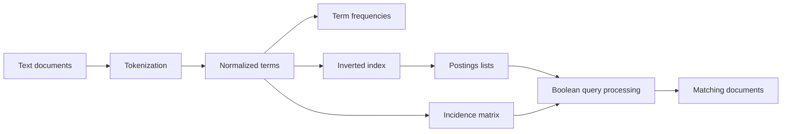

# Boolean Retrieval Engine

A small C++17 Information Retrieval project that turns plain text documents into searchable structures. The project is designed as a learning implementation of the ideas behind Boolean retrieval and inverted index construction.

## What this project demonstrates

- Reading a collection of `.txt` documents
- Tokenization and lowercase normalization
- Counting term frequency inside each document
- Building a term-document incidence matrix
- Building an inverted index with postings lists
- Implementing postings lists with a custom linked list
- Sorting terms and document IDs through ordered containers
- Combining postings with intersection and union operations
- Processing `AND`, `OR`, and `NOT` Boolean queries

## How the data flows



## Data structures

The project uses simple standard library structures so that each part is easy to follow:

| Structure | Purpose |
| --- | --- |
| `vector<Document>` | Stores the loaded documents and their IDs |
| `map<string, PostingList>` | Stores the inverted index in sorted term order |
| `map<int, int>` | Stores document IDs and term frequencies |
| `vector<vector<int>>` | Represents the incidence matrix |
| `set<int>` | Makes Boolean result operations and duplicate removal clear |
| `PostingList` | Custom linked list for document IDs and frequencies |

## Example index

For a small collection, an inverted index can look like this:

```text
index:  D1 [1] D2 [1]
retrieval: D1 [1]
boolean: D2 [1]
```

The number in brackets is the term frequency in that document. A term appears only once in a document's postings list, even when it occurs many times.

## Build and run

### Requirements

- A C++17 compiler
- CMake 3.16 or newer

### Using CMake

```bash
cmake -S . -B build
cmake --build build
./build/boolean_retrieval_engine
```

On Windows with Visual Studio, run:

```powershell
cmake -S . -B build
cmake --build build --config Release
./build/Release/boolean_retrieval_engine.exe
```

The default data directory is `data`. A different directory can be passed as the first argument:

```bash
./build/boolean_retrieval_engine my_documents
```

## Query examples

After the index and matrix are printed, enter queries such as:

```text
index AND search
boolean OR retrieval
NOT sorting
```

Type `exit` to close the program.

## Project structure

```text
.
├── data/                  # Example text collection
├── include/               # Header files
├── src/                   # C++ implementations
├── CMakeLists.txt         # Build configuration
└── README.md
```

## Learning notes

The incidence matrix is useful for understanding the basic model, but it contains many zero values when the collection grows. The inverted index stores only the useful document references, so it is a more practical representation for search systems.

This implementation intentionally keeps the algorithms readable. It is a study project, not a production search engine.

## License

This project is available for educational use.
